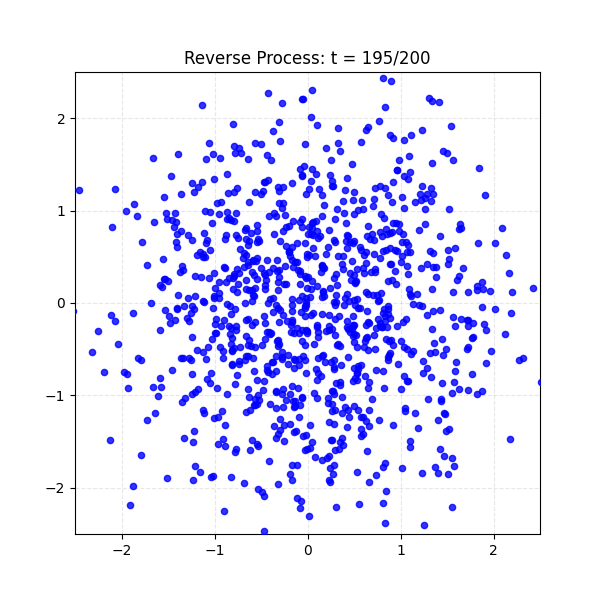

# Denoising Diffusion Probabilistic Model (DDPM) Implementation

[](https://www.python.org/)
[](https://pytorch.org/)
[](https://scikit-learn.org/)

HackMD Article : https://hackmd.io/@bGCXESmGSgeAArScMaBxLA/HkcbC12zWe

這是一個基於 PyTorch 實現的 **去噪擴散概率模型 (DDPM)**。本專案包含從 2D 玩具資料集 (Swiss Roll) 到複雜影像集 (Oxford Pets) 的完整實作，旨在展示擴散模型的前向 (Forward) 擴散與反向 (Reverse) 去噪過程。

## 📂 專案結構 (Project Structure)

```text
.
├── DDPM/                   # 核心演算法實作
│   ├── ForwardProcess.py   # 定義前向加噪過程 (q-sample)
│   ├── ReverseProcess.py   # 定義反向去噪過程 (p-sample)
│   └── NoisePredictor.py   # UNet 架構與雜訊預測模型
├── DDPM_Image.py           # 針對 Oxford Pets 影像資料集的訓練腳本
├── DDPM_Swiss_Roll.py      # 針對 2D Swiss Roll 資料集的訓練與視覺化腳本
├── Dataset.py              # 資料加載器 (支援 Oxford-IIIT Pet 貓咪類別)
├── Plot/                   # 儲存訓練結果與生成的 GIF 動態圖
├── data/                   # 資料集儲存目錄
└── README.md               # 專案說明文件
```

## 🚀 安裝說明 (Installation)

### 1. 複製儲存庫
```bash
git clone https://github.com/jason19990305/Denoising-Diffusion-Probabilistic-Model.git
cd Denoising-Diffusion-Probabilistic-Model
```

### 2. 安裝依賴套件
建議使用 Conda 或 venv 虛擬環境。本專案主要使用 **PyTorch** 與 **Torchvision**。

```bash
# 安裝核心依賴
pip install torch torchvision numpy matplotlib scikit-learn imageio
```

## 🖥️ 使用方法 (Usage)

### 1. 2D Toy Dataset: Swiss Roll
這是一個輕量級的實驗，用於直觀理解擴散模型如何將雜訊轉化為特定形狀的分佈。
```bash
python DDPM_Swiss_Roll.py
```
*   **前向過程**: 將 Swiss Roll 資料逐漸變為高斯雜訊。
*   **反向過程**: 從純雜訊中還原出 Swiss Roll 的形狀。

### 2. Image Generation: Oxford Pets (Cats Only)
針對真實影像進行訓練，目標是生成貓咪的高解析度影像。
```bash
python DDPM_Image.py
```
*   預設使用 `Oxford-IIIT Pet` 資料集中的貓咪品種進行過濾與訓練。
*   包含 **EMA (Exponential Moving Average)** 機制以提升生成品質。

## 📊 結果展示 (Results)

訓練完成後，生成的影像與動態圖將儲存在 `Plot/` 資料夾中。

### 2D Swiss Roll 反向生成
*(範例圖示)*


### 影像生成過程 (Cats)
*(範例圖示)*


## 💡 技術要點
- **UNet Architecture**: 採用自訂的 `DiffUNet` 與時間嵌入 (Time Embedding)。
- **Beta Schedule**: 使用線性 (Linear) Schedule (`beta_start=1e-4`, `beta_end=0.02`)。
- **EMA Training**: 透過 `EMA` 模型參數平滑化，使生成的圖像更穩定。
